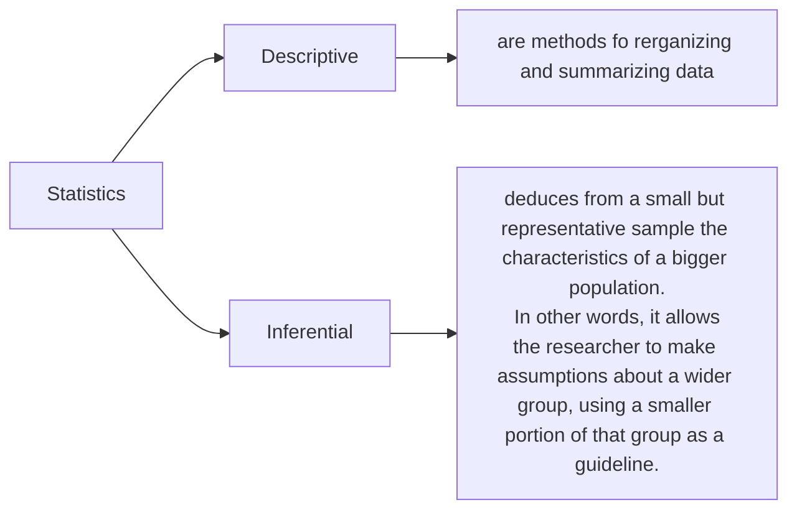

# Definitions

- **Statistics:** is the science of describing or making inferences about the world from a sample of data.



- **Unit:** is a single entity, usually a person or an object, whose characteristics are of interest.
- **Population unit:** is the complete collection of units about which information is sought.
- **Statical population:** is the set of measurements (or record of some qualitative trait) corresponding to the entire collection of units about which information is sought.
- **Sample:** from a statistical population is the subset of measurements that are actually collected in the course of an investigation.

- **Variable:** is a characteristic or condition that can change or take on different values.
- **Datum:** is one observation about the variable being measured.
- **Data:** are a collection of observations.

```mermaid
graph LR;
    Variable --> Qualitative;
    Variable --> Quantitative;
    Qualitative --> Nominal;
    Qualitative --> Ordinal;
    Quantitative --> Discrete;
    Quantitative --> Continues;
    Continues --> Interval;
    Nominal --> id_1["is data that comprises of categories that cannot be rank ordered – each category is just different."];
    Ordinal  --> id_2["It is a qualitative variable that comprises order."];
    Discrete --> id_3["A quantitative variable with possible values of only specific points on a scale is called a discrete variable."];
    Continues --> id_4["This is a variable where the scale is continuous and not made up of discrete steps."];
 ```

 ```mermaid
graph LR;
    Continues --> Interval;
    Interval --> id_1["Interval variables measured on a continuous scale and has no true zero point."];
    id_1 --> Ratio;
    Ratio --> id_2["A ratio variable, has all the properties of an interval variable, and also has a clear definition of 0.0."];

```


A descriptive value for a population is called a parameter and a descriptive value for a sample is called a statistics


- **Tables**

 ```mermaid
graph LR;
    Tables --> id_1["Absolute frequency tables"];
    Tables --> id_2["Relative frequency tables"];
    id_1 --> id_3
    id_2 --> id_3["nominal<br/>ordinal<br/>discrete variable"]
```

- **Graphs**

 ```mermaid
graph LR;
    Graphs --> id_1["Bar chart"];
    Graphs --> id_2["Pie chart"];
    Graphs --> Pictograms;
    Graphs --> Histogram 
    Graphs --> id_3["Density plot"];
    Graphs --> id_4["Scatter plot"];
    Graphs --> id_5["Time series plot"];
    Graphs --> Boxplot;
    id_1 --> id_6["nominal, ordinal and discrete variables."]
    id_2 --> id_7["nominal, ordinal and discrete variables."]
    Pictograms --> id_8["Do not recommended"]
    Histogram --> id_9["numerical variables."]
    id_3 --> id_10["numerical variables."]
    id_4 --> id_11["numerical variables."]
    id_5 --> id_12["numerical variables."]
```

- **Mean:**  is the sum of the data entries divided by the number of entries.

 	$\alpha$